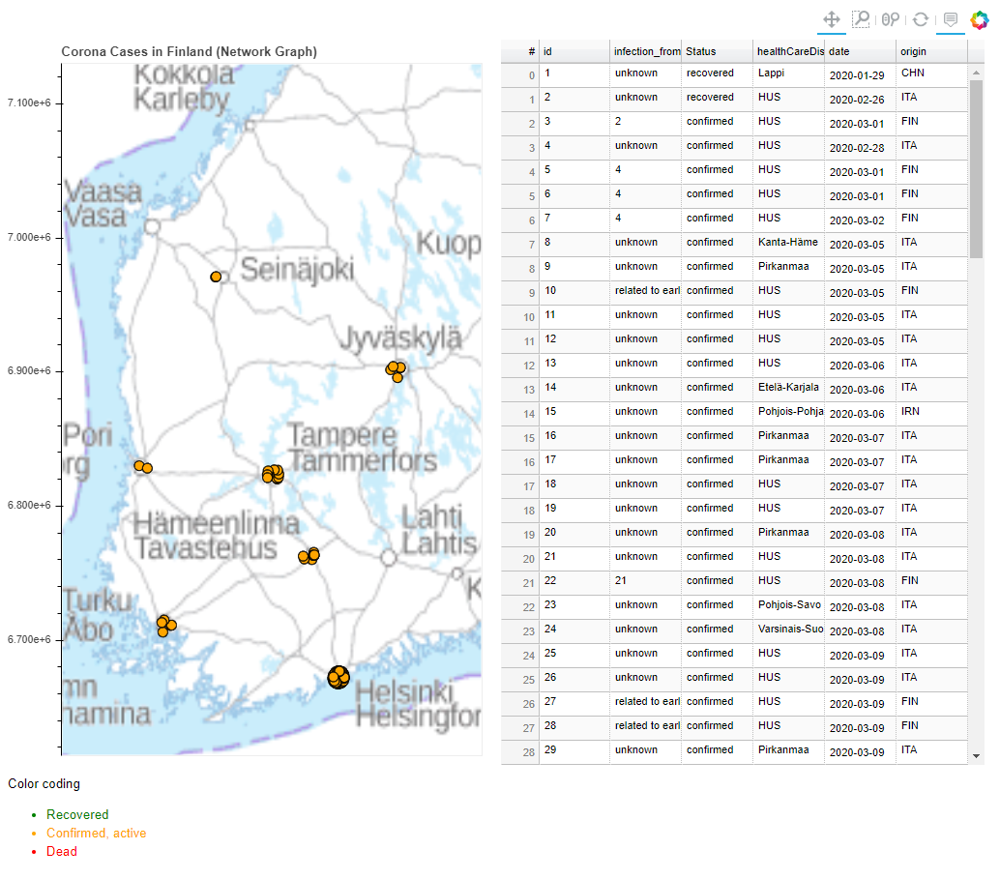

# Corona Infections Finland (Network Graph)
> Interactive network Graph on a map using Corona infection data



Picture Updated: 11.3.2020

---
## How to display it?
1. Clone this repository and open the (prerun) graphs from the _graphs_ folder or just run the [main.py](main.py) script with appropriate packages
2. Copy a HTML from the _graphs_ folder, add the map [Taustakartta_8milj](Taustakartta_8milj.png) to a folder directly back from the HTML

---
## Description
This is a network graph to inspect how the Corona infections spread from person to person in Finland.
This graph uses HS's Corona open data API (https://github.com/HS-Datadesk/koronavirus-avoindata).

Definition of the plot:
- Each dot represents an infection case
- Each link represents a known infection (from person to person)
- Colors represents the source country. Hard coded mapping (black represents lack of mapping).
  - Blue: Finland
  - Green: Italy
  - Red: China
  - Black: Unspecified

---
## Dependencies (for the Python script)
```
Python 3 (tested with 3.6.6)
Bokeh (tested with 1.4.0)
NetworkX (tested with 2.4)
Pandas (tested with 1.0.0)
Numpy (tested with 1.18.1)
```

---

The background map is from Maanmittauslaitos (https://www.maanmittauslaitos.fi/avoindata-lisenssi-cc40).
If suggestions, please feel free to contact me via koli.mikael@gmail.com. In case you find this useful and decide to use this visualization somewhere, I would highly appreciate crediting.


Author: Mikael Koli
